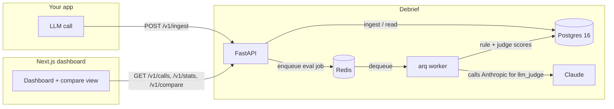

# Debrief

[](https://github.com/ShaliniGupta14/debrief/actions/workflows/ci.yml)

**Flight recorder + quality grader for your LLM app.** Log every call over one HTTP endpoint, then automatically grade it — regex, JSON-schema, length/contains checks, or an LLM-as-judge rubric — and get a statistically-honest verdict on whether your new prompt version is actually better or just noisier.

**[Try the live demo →](https://debrief-six-omega.vercel.app)** (read-only, seeded data, no signup)


## Why this exists

Most teams find out a prompt change regressed quality from a support ticket, not a dashboard. Debrief closes that loop: ingest calls as they happen, run cheap deterministic checks plus an optional LLM judge on a sample of them, and when you ship a new prompt version, `GET /v1/compare` tells you — with a bootstrapped confidence interval, not a single noisy mean — whether it actually got worse.

## What it does

- **Ingest** — `POST /v1/ingest` logs prompt, response, model, tokens, latency, cost (looked up from a point-in-time price table), and arbitrary metadata, in batches, over plain HTTP. No SDK required.
- **Dashboard** — spend by model over time, recent calls, full call detail, all served by Postgres full-text search (no vector DB needed for literal search).
- **Evals** — five types: `regex`, `json_schema`, `length`, `contains`, and `llm_judge` (Claude via tool-use, so the score always comes back as structured JSON, never a string you have to parse and hope). Judge rubrics support calibration: run it N times on a fixed sample, report score variance, so you know how much to trust it before you rely on it.
- **Compare / regression detection** — `GET /v1/compare?version_a=v1&version_b=v2` runs a percentile bootstrap (2000 resamples) on the mean score delta and only flags a regression when the entire 95% CI sits below zero — not just "the mean went down," which is noise on small samples.
- **Ops basics** — structured JSON request logs with request IDs, a Prometheus `/metrics` endpoint, Redis sliding-window rate limiting on ingest, and a public read-only demo mode (mutations 403, reads open) for exactly the page you're looking at now.

## Architecture



Ingest is synchronous and fast (row insert + cost lookup); evals run out-of-band on an arq worker so a slow judge call never blocks the app doing the actual LLM call. See [DECISIONS.md](./DECISIONS.md) for the reasoning behind this and every other non-obvious choice.

## Quickstart

```bash
git clone https://github.com/ShaliniGupta14/debrief.git
cd debrief
cp .env.example .env
docker compose up --build
```

- API: [http://localhost:8000](http://localhost:8000) ([http://localhost:8000/docs](http://localhost:8000/docs) for interactive OpenAPI)
- Dashboard: [http://localhost:3000](http://localhost:3000)

Seed it with realistic fake traffic (four apps, multiple prompt versions, a deliberate regression to detect):

```bash
docker compose exec api uv run python scripts/seed.py --reset --calls 200
```

The seed script prints each project's API key — paste one into the dashboard's key field, or use it directly:

```bash
curl -X POST http://localhost:8000/v1/ingest \
  -H "X-API-Key: sk_..." -H "Content-Type: application/json" \
  -d '[{"model":"claude-sonnet-5","prompt":"hi","response":"hello!","input_tokens":5,"output_tokens":3,"latency_ms":210}]'
```

To score calls with an LLM judge, set `ANTHROPIC_API_KEY` in `.env` before `docker compose up` — everything else works without it (rule-based evals don't need a key at all).

## Stack

Python (FastAPI, SQLAlchemy 2.0 async, Pydantic v2, Alembic) · Postgres 16 · Redis + arq · Next.js 14 (App Router, TypeScript, Tailwind, Recharts) · Docker Compose for local dev, Railway + Vercel for the hosted demo.

## What I'd build next

- **True per-call regression pairing.** `compare` currently groups by exact prompt text and compares mean scores per version — statistically sound but not literal per-call pairing. A client-supplied `metadata.test_case_id` at ingest time would let two versions' responses to *the same test case* be diffed directly.
- **A real ingest SDK.** Right now it's raw HTTP by design (zero install friction for the demo), but a thin Python/TS wrapper (retry, batching, non-blocking fire-and-forget) is the obvious next layer for real usage.
- **Semantic search.** Full-text (`tsvector`) covers literal search; "find prompts similar to this one" needs embeddings + pgvector, deliberately deferred since it wasn't in the original scope.
- **Per-project rate limit tiers and API key rotation** instead of one global default.
- **Multi-process Prometheus registry.** The current `/metrics` uses `prometheus_client`'s default global registry, which is single-process-only — fine for one API replica, would need the multiprocess mode (or push-gateway) behind a real load balancer.

See [DECISIONS.md](./DECISIONS.md) for the full build log and reasoning behind every non-obvious tradeoff made getting here.
